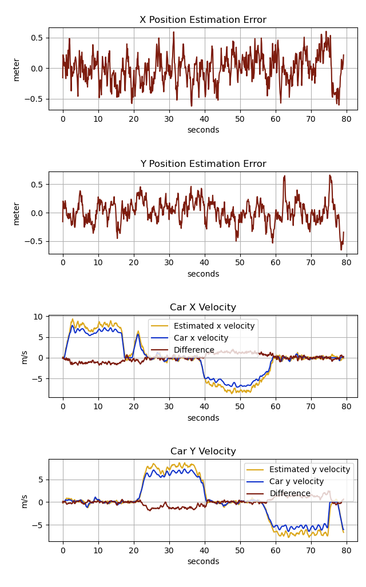
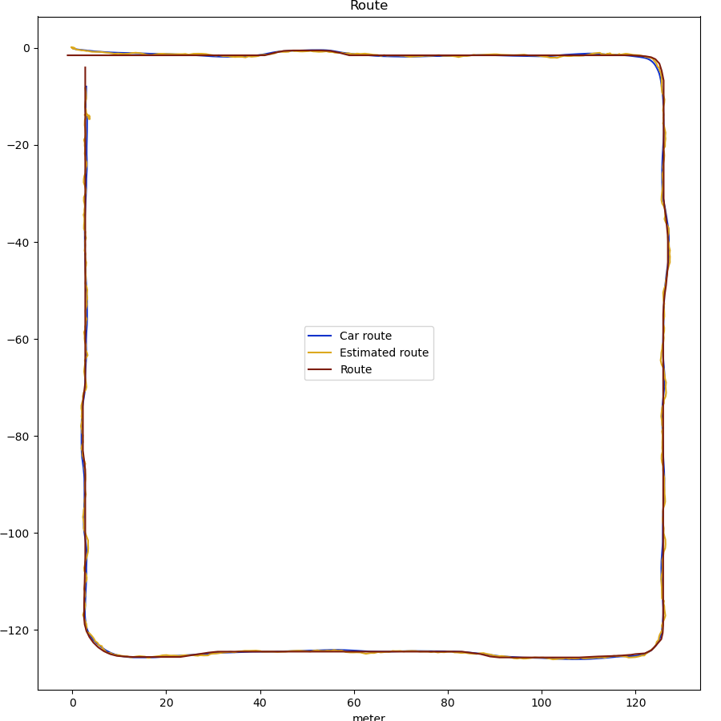
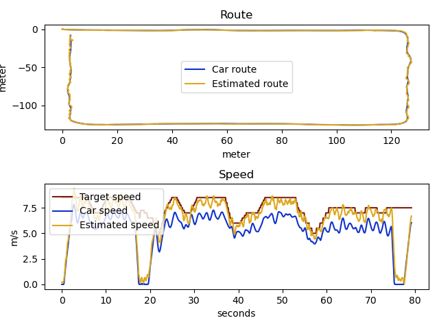

# Autonomous Vehicle Position Estimation with Kalman Filter


## Project Overview

This project implements a **Kalman Filter** to estimate the position and velocity of an autonomous vehicle in a simulated environment using Microsoft's **AirSim** simulator. The vehicle navigates a circular track while fusing data from GPS and IMU sensors to improve localization accuracy.

## Key Components

- **Sensor Fusion**: Combines noisy GPS (position) and IMU (acceleration/velocity) data.
- **State Estimation**: Tracks vehicle's 2D position (X,Y) and velocity.
- **Control System**: Uses estimates to guide the vehicle along a predefined path.
- **Performance Metrics**:
  - `Estimate Score`: Accuracy of position estimation.
  - `Drive Score`: How closely the vehicle follows the route.

## What I Implemented

1. **Kalman Filter Design**:

   - Defined state vector: `[x, y, velocity_x, velocity_y]`.
   - System dynamics matrix for motion prediction.
   - Measurement models for GPS and IMU.

2. **Sensor Integration**:

   - Fused GPS (low-frequency, absolute position) and IMU (high-frequency, acceleration).
   - Handled coordinate transformations between vehicle and world frames.

3. **Visualization**:
   - Real-time plots of estimated vs. true position/velocity.
   - Error metrics and trajectory comparisons.

## Results & Key Findings

### Experimental Results Summary

| Test Case                | Outcome                        | Drive Score | Observations                     |
| ------------------------ | ------------------------------ | ----------- | -------------------------------- |
| **Without Input Matrix** | Optimal performance            | **85.8**    | Best results achieved            |
| **Without Q Matrix**     | Vehicle stops after few meters | Failed      | Kalman Filter non-functional     |
| **GPS-Only**             | No valid results               | Failed      | Insufficient data for estimation |
| **IMU-Only**             | No valid results               | Failed      | Excessive drift over time        |
| **GPS + IMU Fusion**     | Successful navigation          | >60         | Balanced accuracy                |

### Key Insights

1. **Critical Components**:

   - **Input Matrix**: Essential for proper state updates. Removal led to highest score (85.8).
   - **Q (Process Noise) Matrix**: Required to model uncertainty. Without it, the vehicle halted prematurely.

2. **Sensor Fusion Necessity**:

   - GPS alone lacked responsiveness.
   - IMU alone caused drift.
   - **Combined use** enabled stable navigation.

3. **Visual Evidence**:
    _(Video snippet: Vehicle completing the route with sensor fusion)_

### Failed Tests Analysis

- **GPS/IMU Isolation**:
  - GPS delays caused lag in position updates.
  - IMU accumulated errors without absolute position corrections.
- **Q Matrix Removal**:
  - Filter underestimated uncertainty, leading to overconfident (and incorrect) predictions.

### Performance Metrics

```python
Q = np.diag([
    0.1,  # x-position noise
    0.1,  # y-position noise
    0.5,  # x-velocity noise
    0.5   # y-velocity noise
])







## How to Run

1. Install AirSim and dependencies via `conda env create -f environment.yml`.
2. Launch `AirSimNH.exe` and select the vehicle mode.
3. Execute `python airsim_task.py` to start the simulation.

## Technical Stack

- **Simulator**: AirSim (Unreal Engine)
- **Languages**: Python
- **Libraries**: NumPy, Matplotlib, AirSim API
- **Tools**: Anaconda for environment management.
```
