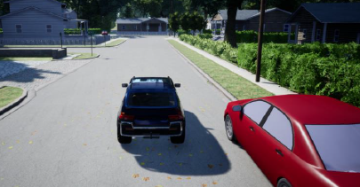
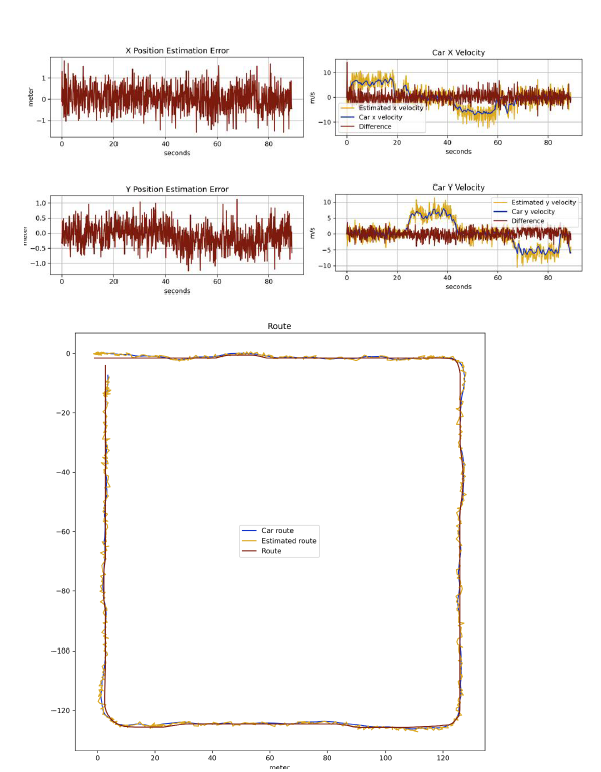

# Autonomous Vehicle Position Estimation with Kalman Filter

## Project Overview

This project implements a **Kalman Filter** to estimate the position and velocity of an autonomous vehicle in a simulated environment using Microsoft's **AirSim** simulator. The vehicle navigates a circular track while fusing data from GPS and IMU sensors to improve localization accuracy.

## Key Components

- **Sensor Fusion**: Combines noisy GPS (position) and IMU (acceleration/velocity) data.
- **State Estimation**: Tracks vehicle's 2D position (X,Y) and velocity.
- **Control System**: Uses estimates to guide the vehicle along a predefined path.
- **Performance Metrics**:
  - `Estimate Score`: Accuracy of position estimation.
  - `Drive Score`: How closely the vehicle follows the route.

## What I Implemented

1. **Kalman Filter Design**:

   - Defined state vector: `[x, y, velocity_x, velocity_y]`.
   - System dynamics matrix for motion prediction.
   - Measurement models for GPS and IMU.

2. **Sensor Integration**:

   - Fused GPS (low-frequency, absolute position) and IMU (high-frequency, acceleration).
   - Handled coordinate transformations between vehicle and world frames.

3. **Visualization**:
   - Real-time plots of estimated vs. true position/velocity.
   - Error metrics and trajectory comparisons.

## Results

- Achieved a **Drive Score > 60** by optimally tuning the Kalman Filter.
- Demonstrated that sensor fusion (GPS + IMU) outperforms single-sensor approaches:
  - GPS-only: Stable but laggy.
  - IMU-only: Drifts over time.
  - Combined: Balanced accuracy and responsiveness.

## How to Run

1. Install AirSim and dependencies via `conda env create -f environment.yml`.
2. Launch `AirSimNH.exe` and select the vehicle mode.
3. Execute `python student_task.py` to start the simulation.

## Technical Stack

- **Simulator**: AirSim (Unreal Engine)
- **Languages**: Python
- **Libraries**: NumPy, Matplotlib, AirSim API
- **Tools**: Anaconda for environment management.
